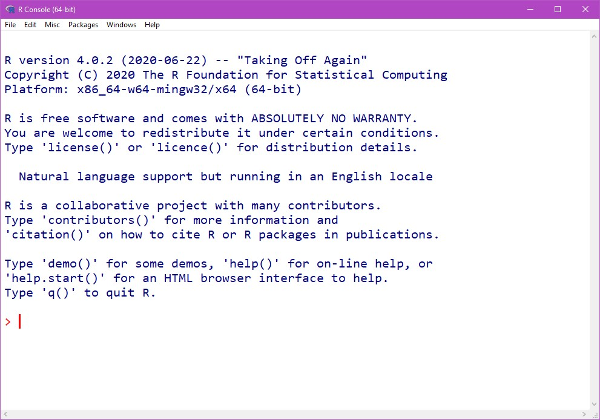

```{r setup, include=FALSE}
knitr::opts_chunk$set(echo = TRUE)
```

## Learning Objectives

### Statistical Learning Objectives
1. Visualize categorical data
2. Summarize quantitative and categorical data

### R Learning Objectives
1. Learn the difference between R, R Studio, and R Markdown
2. Become familiar with the R Studio interface 
3. Understand key components of an R Markdown document
4. Become familiar with R functions and arguments

### Functions covered in this lab
1. `barplot()`
2. `summary()`

## Lab Tutorial

### Getting Started: What is R?
[link to install info](canvas.umich.edu)
**TODO: MAKE THIS AN ACTUAL URL** 

In Statistics, we often use computers to analyze data. There are a lot of programs that can help you do statistical analyses. One of the most popular (and powerful) is called R. R is a "statistical computing environment" that is designed for manipulating data, doing calculations, and making graphical displays. R works by writing **R code**.

That might sound scary, but *don't worry*: this is not a programming class. Over the course of the semester, you'll learn how to edit and write some basic R code to help you analyze data to answer research questions. Our goal in lab is to help you learn the basics of R and R coding, but through the lens of answering statistical questions. 


You may accidentally at some point open the "R GUI" which is *not* R Studio. You're generally going to want to open R Studio instead.



#### What are all these "R" terms?
There are a lot of "R" words floating around. What's going on?

- *R* is a "statistical computing environment" that's designed for manipulating data, generating plots, and performing analyses. It's also a programming language. You'll be *using R* this semester.
- *R Studio* is an "integrated development environment (IDE)" for R (you'll never have to hear the term IDE again in this class). Basically, it's a pretty interface that makes working with R easier. You use R inside of R Studio. If R is ice cream, R Studio is the cone or cup.
- *R Markdown* is a way to write pretty analysis reports that combines R code, R output (plots, analysis results, etc.) and text in one document. This lab document is an R Markdown report!

### R Markdown

This is an R Markdown document. R Markdown lets you combine text, R code, and plots in one pretty, reproducible report. If you're curious about this, you can find more details on using R Markdown at <http://rmarkdown.rstudio.com>.

R Markdown runs code contained in "chunks". A chunk looks like this:
```{r helloWorld}
print("Hello world!")
```
Notice that the code, `print("Hello world!")` is contained between three backticks (```, right below the esc key on a US English keyboard) -- this is how R Markdown knows where your chunks start and stop.

When you click the **Knit** button in R Studio, a document will be generated that includes both content as well as the output of any embedded R code chunks within the document. 

#### Tips for R Markdown
1. **Knit and knit often**: Frequently knitting your document will help you make sure that all your code works and that the document looks the way you want.
2. **Don't be afraid to experiment**: Nobody gets things exactly right the first time, and we all forget how things work sometimes. Keep trying, and you'll eventually get what you want!
3. **Formatting**: You can make text **bold** by surrounding it with two asterisks (`**`) and *italic* by surrounding it with one asterisk (`*`).

### Using R as a Calculator
At it's most basic, R is a fancy calculator. **TODO: LINK TO HOW TO DO MATH IN R**

You can just run a single chunk by clicking the green "play" button in the upper right corner of the chunk.
```{r calculatorExample}
5 * 7
```
When you run the chunk, you'll see a `[1]` before the output of `35`. *Just ignore this. The result is `35`.*

**Try it yourself!**
In the chunk below, compute 50 divided by 9. You'll notice the chunk contains the text `# Write code here!`. This is called a "comment" -- it's not code that R runs, it's just there to explain your code. Feel free to delete and replace it, or start a new line and type there. See what happens!
```{r, tryItCalculator}
# Write code here!
```


### Palmer Penguins Data
We're going to start by working with a data set with data on 344 penguins collected from 3 islands in the Palmer Archipeligo in Antarctica. Data were collected and made available by [Dr. Kristen Gorman](https://www.uaf.edu/cfos/people/faculty/detail/kristen-gorman.php)
and the [Palmer Station, Antarctica LTER](https://pal.lternet.edu/), a member of the [Long Term Ecological Research Network](https://lternet.edu/), and the data were prepared by [Dr. Allison Horst](https://github.com/allisonhorst/palmerpenguins).


**TODO: Link to codebook**

We'll talk more about the specifics of this next week, but for now know that this is creating a data set called `penguins`, and the data is coming from the URL in the innermost parentheses.

**TODO: FORK PALMERPENGUINS, REMOVE NA'S**
```{r readData}
penguins <- read.csv(url("https://raw.githubusercontent.com/allisonhorst/palmerpenguins/master/inst/extdata/penguins.csv"))
penguins <- penguins[complete.cases(penguins), ]
```

Let's see what's in the data. We can peek at the first few (6, specifically) rows of the data using the `head()` function:
```{r headPenguins}
head(penguins)
```
We read that line as "*head* of *penguins*". Remember that `penguins` is what we named our data set. We can see that `penguins` contains a number of *variables*, like `species`, `island`, and more. 


### Bar Plots in R
Let's explore our `penguins` data by making a plot that will help us visualize a categorical variable. We'll start by looking at the number of penguins observed of each species.

```{r speciesPlot}
barplot(table(penguins$species),
     xlab = "Species",
     ylab = "Frequency",
     main = "Bar Plot of Number of Penguins of Each Species Observed",
     col = c("darkorange1", "mediumorchid2", "darkcyan"))
```


### Numerical Summaries
In addition to analyzing data visually, we can also use R to summarize data numerically. We'll use the `summary()` function to do that for a given variable. Here, we'll summarize the `flipper_length_mm` variable, which is the length of the penguins' flippers (in millimeters). 
```{r flipperSummaries}
summary(penguins$flipper_length_mm)
```
R gives us 6 numbers: the minimum (shortest) flipper length, the first quartile, the median (middle) flipper length, the mean (average) flipper length, the third quartile, and the maximum (longest) flipper length. We'll talk about each of these in more detail later in the course!

## Try It!
With a group of up to three people (including you), complete the following exercises.

**Group Members**: Replace this text with the names of your group members.

> **1.** Which of the variables in `penguins` are *quantitative* and which are *categorical*?

*Answer:*  Replace this text with your answer.


> **2.** Make the same graph for the number of penguins observed on each island in the Palmer Archipelago, using the `islands` variable in the `penguins` data set. *Hint: be sure to change the axis labels and title too!* \n
If you have time, play around with the colors! (things like "red", "yellow", "blue" work, but see [here](http://www.stat.columbia.edu/~tzheng/files/Rcolor.pdf) for a list of possible color names in R if you're more adventurous.)

```{r islandPlot}
# Get started by copying and pasting the code from the speciesPlot chunk above! (Remember that this text is a comment, so it's not run by R; you can delete it if you want.)
```

> **3.** Recreate the numerical summaries for the `bill_length_mm` variable. What is the mean (average) bill length?

```{r billSummaries}
# Get started by copying and pasting the code from the flipperSummaries chunk above! (Remember that this text is a comment, so it's not run by R; you can delete it if you want.)
```

*Answer:* Replace this text with your answer to the question about mean bill length.

## Group Discussion
Now you'll dive deeper into the analysis. Maybe you'll discuss a different application, or preview the next week's topic. You'll also have the chance to draw substantive conclusions from your analysis, and to think more deeply about what it is you've just done, and why.

> Talk About It 1: What's something you learned today? It can be about statistics, R, penguins, or anything else related to STATS 250.

*Write 1-2 sentences about your answer here*

> Talk About It 2: How do you think statistics can help you in your major or future career?

*Write 1-2 sentences about your answer here*

> Talk About It 3: What was the best part of lab for you today? What was a challenging part?

*Write 1-2 sentences about your answer here*


## Wrap-Up and Submission

When you've finished the lab, click the **Knit** button one last time. Then, in the folder where you saved this .Rmd file when you downloaded it from Canvas, you'll see an HTML file with the same name (for example, `lab01.html`). **This is what you will upload to Canvas as your submission for Lab 1.**

**TODO: Screenshots!**
