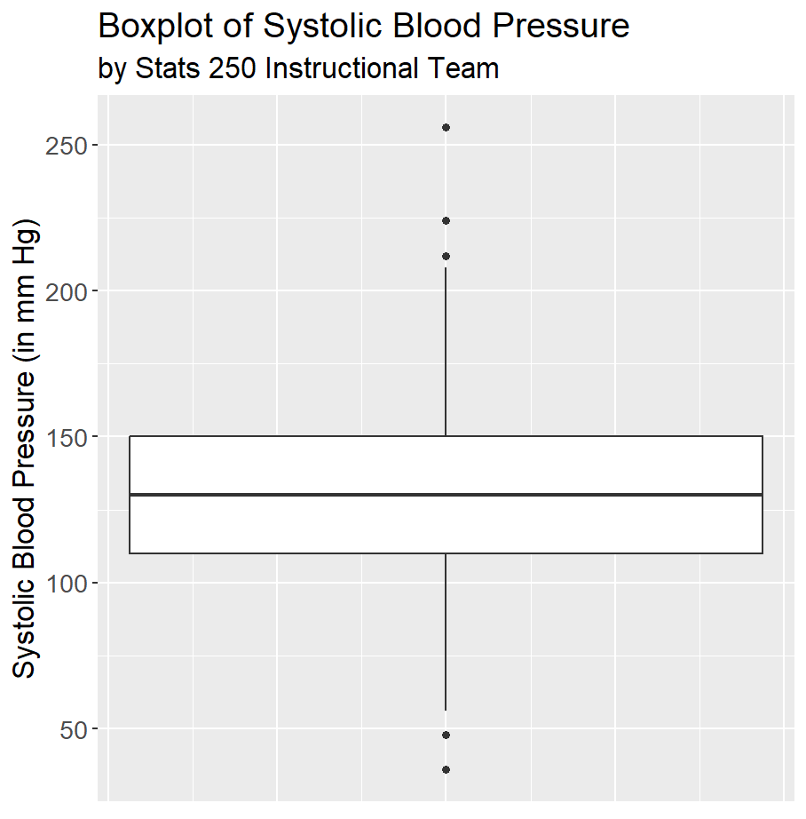

```{r setup, include=FALSE}
knitr::opts_chunk$set(echo = TRUE)
```

### Instructions

Complete the lab exercises and Dive Deeper questions below. Lab exercises will be graded out of 2 points each and the Dive Deeper questions will be graded out of 3 points each - all of them will be graded for *correctness*. Upon completion, follow the submission instructions at the bottom of this document. We strongly encourage you to work on this assignment with a partner, but each student must submit their own lab assignment.

***

### Background

Data from a sample of 200 patients following admission to an adult intensive care unit (ICU). The data contain information on the following variables:

1. ID	Patient ID number
2. Status	- Patient’s status: lived or died
3. Age -	Patient’s age (in years)
4. Sex - male or female
5. Race	- black, white, or other
6. Service - medical or surgical
7. Cancer	- Is cancer involved? yes or no
8. Renal - Is chronic renal failure involved? yes or no
9. Infection	- Is infection involved? yes or no
10. CPR	- Patient gets CPR prior to admission? yes or no
11. Systolic - Systolic blood pressure (in mm Hg)
12. HeartRate - Pulse rate (beats per minute)
13. Previous - Previous admission to ICU within 6 months? yes or no
14. Type - elective or emergency
15. Fracture - Fractured bone involved? yes or no

Use the following code chunk to read in the above data set.

```{r read_data}
load("ICUAdmissions.rda")
```

And be sure to load in the required packages!

```{r load_packages}
library(ggplot2)
```


***


### Lab Exercises

After reading the background above, complete the following lab exercises. Remember, these exercises are worth 2 points each and are graded for *correctness*.

> 1. After reading the background above, propose a question that could be answered using the ICU data set provided. Your question should involve two variables - *one quantitative variable and one categorical variable*. After stating your question, identify which variable is acting as the response variable and which variable is acting as the explanatory variable.

*Question:* Replace this text with your proposed question.

*Response Variable:* Replace this text with the name of your response variable.

*Explanatory Variable:* Replace this text with the name of your explanatory variable.


> 2. First, create a set of side-by-side boxplots that would help answer your proposed question. *Be sure to appropriately update the plot title and axis labels.* Then, use a combination of the `aggregate()` and `summary()` functions to compute the numerical summaries of your quantitative variable by the groups of your categorical variable. Remember, this output will not display in your R Markdown document, but it will show up once you knit the file.  

```{r exercise2a}
# Replace this comment with your code

```

```{r exercise2b}
# Replace this comment with your code

```


> 3. Using the results from Exercise 2, write a 2 - 3 sentence conclusion regarding your proposed question of interest from Exercise 1.

*Answer:* Replace this text with your answer.


> 4. Propose another question that could be answered using the ICU data set provided. Your question should involve two *categorical* variables. After stating your question, identify which variable is acting as the response variable and which variable is acting as the explanatory variable.

*Question:* Replace this text with your proposed question.

*Response Variable:* Replace this text with the name of your response variable.

*Explanatory Variable:* Replace this text with the name of your explanatory variable.


> 5. Create a stacked or grouped bar chart that would help answer your proposed question. *Be sure to appropriately update the plot title and axis labels.*

```{r exercise5}
# Replace this comment with your code

```


> 6. Use the first code chunk to create a two-way frequency table (also known as a contingency table) for your two categorical variables of interest. Use the `addmargins()` function to add row and column totals to your table. Then, use the second code chunk as a calculator to compute probabilities that will help you determine if an association exists between your two variables of interest. 

```{r exercise6a}
# Replace this comment with your code

```

```{r exercise6b}
# Replace this comment with your code

```


> 7. Using the results from Exercise 5 and 6, write a 2 - 3 sentence conclusion regarding your proposed question of interest from Exercise 4.

*Answer:* Replace this text with your answer.


***


### Dive Deeper Questions

After completing the lab exercises above, complete the following Dive Deeper questions. Remember, these questions are worth 3 points each and are graded for *correctness*.

> **1.** Is the following statement appropriate? “From the boxplot of systolic blood pressures (below), we can conclude that the distribution of systolic blood pressures is unimodal and approximately symmetric.” Briefly explain your answer.

{width=250px}

*Answer:* Replace this text with your answer.


> **2.** Think of a variable that might be considered a "confounding" variable for one of the two analyses you completed in the Lab Exercises. In other words, brainstorm a variable that might have a relationship or association with *both* the explanatory variable and the response variable. (Note: this variable does not necessarily need to be one of the variables in the data set.) Describe the variable and the potential relationships it may have with the response and explanatory variables. 

*Answer:* Replace this text with your answer.


***


### Submission Instructions

Once you have finished, follow the instructions below to submit your work.

1. At the top of the document, change the `author` field to your name (in quotes!). **Do not change any of the other fields (title, date, output) at the top of the document.**

2. Click the Knit button to create an HTML file of your work. If you get an error that says "Duplicate chunk label", go back and check your code chunk names - each one must have a unique name! 

3. In the Files pane (bottom right window), check the box next to `lab02_assignment.html`. 

4. In the Files pane, click on the gear icon (More) and select "Export..."  

5. Do not change the file name (`lab02_assignment.html`). Click Download and save the file to your computer. 

6. On the Stats 250 Canvas site, navigate to the Lab 2 assignment. 

7. Upload your saved `lab02_assignment.html` file. 

8. Click "Submit Assignment". Congratulations, you are done with Lab 2!


